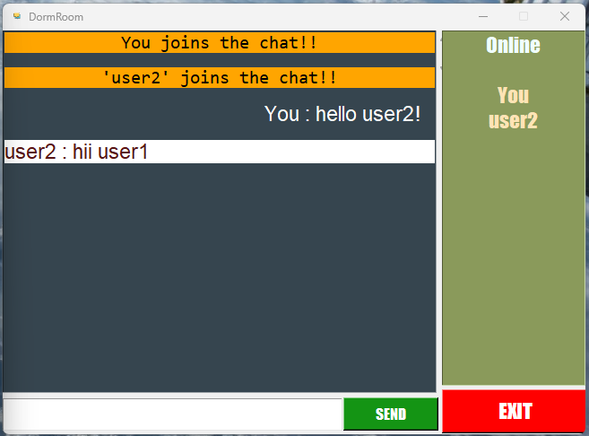

# --- For Windows Users ---


# Online_DormRoom

Chat application made with tkinter in python!!

<p align="center">
  
</p>


## Run Locally

Clone the project

```bash
  git clone https://github.com/a-b-h-a-y-s-h-i-n-d-e/Online_DormRoom.git
```

Go to the project directory

```bash
  cd my-project
```

Install dependencies


```bash
  pip install sockets 
```

Start the server

```bash
  python server.py
```

Now on another cmd, Run the main.py  


```bash
  python main.py
```


## images

**Login Page**

<p align="center">
  
</p>

**Chat Page**

<p align="center">
  
</p>

## Tech Stack

Python [Tkinter, Sockets]


## License

Software should be free!!


# --- For Linux Users ---

-> download appropriate fonts first!

-> just use lmain.py instead of main.py
                OR
-> comment out code present at 24 and 203 lines and uncomment given below codes


        